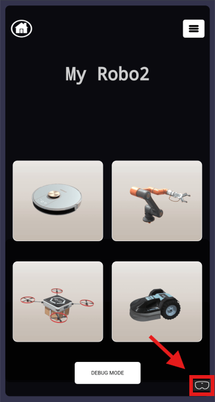
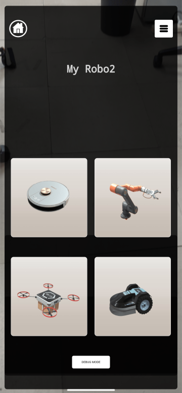
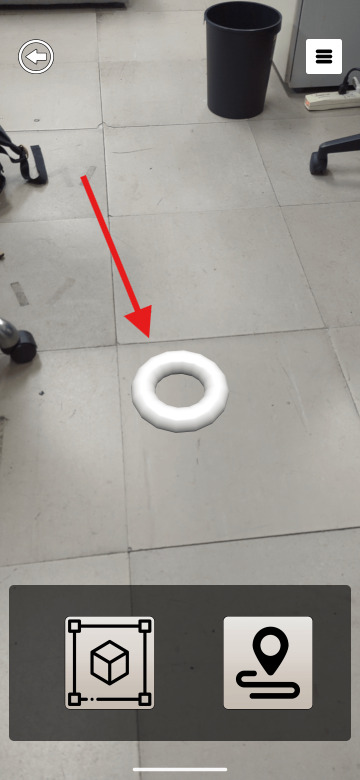
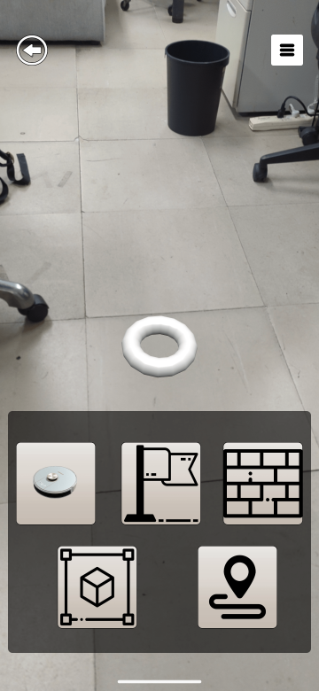

# MyRobo
## Overview
MyRobo is a web application for robot simulation using OimoJS physic engine, BabylonJS and WebXR

MyRobo allows the user to see the simulation robot (AR) executing a service set by the user.
The service here is the movement of the robot body or end effector to the target point.
Therefore, the following steps are performed.

## How to run locally
If you want to develop for the long term, we recommend using Apache.
If you want to use it for a short term, you can use a script to set up a web server in python.

To run the project enter this command:
```
python3 https_server.py
```

### How to create a certificate file
The certificate file exists in `MyRobo/cert`.
If you need to create it for some reason, just execute the following.

(Certificate - necessary for https communication on the local host)

```
openssl req -x509 -newkey rsa:2048 -keyout key.pem -out cert.pem -nodes

```

and put the two files you created into the directory `MyRobo/cert`.

# How to use it

1. At the start the user arrive on the website and launch babylonJS
<p align="center">
    
</p>
2. After, the user need to start AR (webXR) with the button in right bottom corner
<p align="center">
    
</p>
3. The user can now choose between different meshs (Vacuum cleaner, Arm robot, Drone and Mower)
<p align="center">
    
</p>
4. Also you can display or not the debug mode with the button at the bottom, to see every trajectory and understand how the simulation works.


<br clear="left"/>
</br>
5. Now the user can target the floor to make appeared a ring-shaped object that defines the surface
<p align="center">
    
</p>
6. We can see now 2 buttons at the bottom, one is a menu for objects and the other one is for start the simulation.
<p align="center">
    
</p>
7. In the top right corner, there is the option buttons where you can change speed of the robot, create excel file and also reset the simulation.
<p align="center">
    
</p>
8. With the objects menu you can put the robot, obstacles and also a flag (target point)
<p align="center">
    
</p>
9. The user can move objects objects by dragging them with finger
</br>
10. When we drag an object, we can move it to the top right corner to delete it.
<p align="center">
    
</p>
11. With the simulation button you can start simulation if the robot and the flag (target point) are display in the scene and also you can end simulation if you press another time the button.
<p align="center">
    
</p>

## Full simulation demonstration

1. With debug
<p align="center">
    
</p>

2. Without debug
<p align="center">
    
</p>
